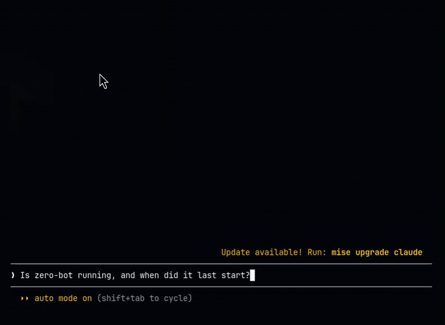

# homelab-mcp

Raspberry Pi homelab status, exposed as an [MCP](https://modelcontextprotocol.io)
server — so an MCP client (Claude Code, Claude Desktop) can be asked "how's
the homelab doing?" and get real systemd service health, disk usage, CPU
temp, and the LAN game-server feed back directly, instead of SSHing in and
checking by hand.

Read-only by design: every tool queries state, nothing restarts, stops, or
reboots anything.



## Architecture

The server runs **on the Pi itself** — not on the machine running the MCP
client — since that's where the systemd units, disk, and thermal sensor
actually are. The MCP client reaches it over SSH-tunneled stdio: SSH just
exposes a local stdio process to a remote client, no special MCP-side
support needed.

```
MCP client (laptop) --ssh--> homelab-mcp server (on the Pi) --> systemctl / /sys/class/thermal / /proc/uptime
                                                            \--> HTTP GET to the LAN game-server status feed (192.168.1.111:8091)
```

See [`Chain-P/homelab`](https://github.com/Chain-P/homelab) for the full
writeup of the Pi/homelab setup this project queries.

## Tools

| Tool | Description |
|---|---|
| `system_summary()` | One-shot health check: hostname, uptime, load average, disk usage, CPU temp, and every known service's status. |
| `service_status(name)` | Detailed systemd status for one service: `tracker-app`, `coinbot`, `zero-bot`, or `zero-two`. |
| `disk_usage(path="/")` | Total/used/free bytes and percent used for a filesystem path. |
| `game_server_status()` | Proxies the Windows box's existing game-server status feed (Minecraft/Zomboid/Terraria host). |

`service_status` only accepts the four known unit names above — the MCP tool
schema itself rejects anything else before the tool body ever runs.

## Requirements

- Python 3.10+ (the Pi's system Python is 3.9, hence [`uv`](https://docs.astral.sh/uv/) below)
- Linux with `systemctl` and a `/sys/class/thermal/thermal_zone0/temp` sensor
- SSH key access to the host this runs on

## Install & run (on the Pi)

```bash
curl -LsSf https://astral.sh/uv/install.sh | sh   # installs uv, no root needed
uv python install 3.12
git clone https://github.com/Chain-P/homelab-mcp.git
cd homelab-mcp
uv venv --python 3.12 venv
venv/bin/pip install -e .
venv/bin/homelab-mcp   # smoke test — should hang waiting on stdio, Ctrl+C to stop
```

## Configure in an MCP client

Since the server lives on the Pi and the client runs elsewhere, invoke it
over SSH:

```json
{
  "mcpServers": {
    "homelab": {
      "command": "ssh",
      "args": ["pi@zero.local", "/home/pi/homelab-mcp/venv/bin/homelab-mcp"]
    }
  }
}
```

Then ask the client something like "how's the homelab doing?" or "is
tracker-app running?"

## Development

Tests mock every hardware/systemd dependency (`subprocess.run`,
`/sys/class/thermal/...`, `/proc/uptime`, the game-server HTTP call), so
they run identically in CI and on the Pi — no real systemd state required:

```bash
pip install -e ".[dev]"
ruff check .
pytest
```

## Roadmap

- Log tailing for the known services.
- A mutating tool (restart a service) — deliberately not in v1; read-only
  first, gate anything that changes state separately and explicitly.

## License

MIT
